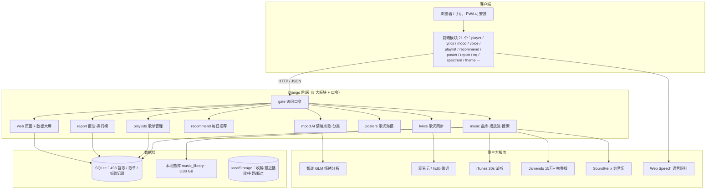
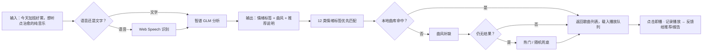

# 云律 AI · 项目验收演示方案

> 项目定位一句话：**一款"懂情绪"的音乐播放器**——用 AI 理解你的心情，用数据读懂你的品味。
> 技术栈：Django + 原生 JS + SQLite + 智谱 GLM + 多在线音乐源。
> 建议演示时长：**15~20 分钟**。

---

## 一、曲库规模与来源

### 1. 本地曲库（核心资产）

| 指标 | 数据 |
|---|---|
| 已入库歌曲 | **498 首**（461 MP3 + 37 FLAC） |
| 总容量 | **约 3.08 GB** |
| 歌词文件 | 152 份 `.lrc`（命中率约 30%，其余由在线歌词兜底） |
| AI 情绪打标 | **498 首全部完成**（12 类情绪标签） |
| 歌手覆盖 | 中外主流歌手（Adele / Avicii / Alan Walker / 周杰伦 / Ne-Yo 等）+ 电音 / 纯音乐 / 民谣等多曲风 |

**来源说明**：
- 本地文件为个人收集的真实音乐资源（按「歌手 - 歌名.mp3」规范命名），通过项目自带工具 `copy_songs.py` 从分散文件夹**一键收集汇总**（自动去重、连歌词一起拷贝），放入 `music_library/` 后由系统扫描入库、读取 ID3 元数据；
- 早期开发阶段用 `scripts/gen_seed_music.py`（Python 合成旋律 WAV）验证扫描/播放链路，已被真实曲库取代；
- 曲库按歌手分子目录组织（如 `周杰伦/`、`Ne-Yo/`）。

### 2. 在线曲库（三源合一，无需下载即搜即播）

| 音乐源 | 说明 | 播放能力 |
|---|---|---|
| **Jamendo**（优先） | CC 授权开放平台，**15 万+ 首**独立音乐人作品 | 完整播放（免费额度约 500MB/天） |
| **SoundHelix** | 无版权纯音乐 | 完整播放 |
| **iTunes** | Apple 官方搜索 API | 30 秒试听 |

- 三源按「完整版 > 纯音乐 > 试听」优先级合并展示，互不冲突；
- **可扩展架构**：新增音乐源只需继承 `MusicSource` 抽象类并注册一行代码，其他代码零改动（这是架构创新点，答辩可重点讲）。

### 3. 歌词数据

- 本地 152 份 LRC；无本地歌词时自动**在线两级兜底抓取**（网易云 → lrclib），成功后缓存为 `.lrc` 文件；
- 支持 UTF-8 / GBK / GB18030 多编码兼容。

---

## 二、创新点总览（答辩话术清单）

| # | 创新点 | 一句话讲解 |
|---|---|---|
| 1 | **AI 情绪点歌台** ⭐核心 | 输入一句心情，智谱 GLM 分析情绪 → 从 12 类情绪标签匹配歌曲，实现"心情驱动"的听歌方式 |
| 2 | **AI 歌曲情绪分类** ⭐ | 按「歌名+歌手+歌词片段」批量判定每首歌的情绪标签，498 首全部打标，解决"一刀切 happy"问题 |
| 3 | **语音点歌** | Web Speech API 语音识别 + 后端语义解析（歌手/情绪/曲风/随机），配合快捷指令 chips |
| 4 | **多源在线曲库 + 抽象层** | iTunes / Jamendo / SoundHelix 三源合一，插件式架构可扩展 |
| 5 | **每日推荐 + 可解释** | 基于听歌记录的标签相似度打分，附「为什么推荐」理由 |
| 6 | **数据大屏** ⭐ | 实时播放统计看板：KPI 指标、7 天趋势、情绪分布、热歌榜、24 小时分布、实时播放流，可全屏演示 |
| 7 | **歌词生态** | LRC 滚动高亮 + 在线兜底抓取 + Canvas 歌词意境海报一键下载 |
| 8 | **播放增强** | Canvas 频谱可视化、10 段均衡器、定时关闭、断点续播记忆、Media Session 锁屏控制 |
| 9 | **主题换肤** | CSS 变量驱动的 7 套主题，一键全站换肤、本地记忆、无首屏闪烁 |
| 10 | **PWA 安装** | 安装到桌面/手机主屏，standalone 全屏运行，全套尺寸图标 |
| 11 | **歌单生态** | 创建/封面上传/拖拽排序/右键快捷菜单/一首歌进多个歌单 |
| 12 | **访问口令** | 分享保护（默认 `yunlv888`），7 天免登 |
| 13 | **听歌报告** | 播放统计总结 + 热门榜 + 情绪分布 |

---

## 三、流程图

### 图 1 · 系统架构图

### 图 2 · AI 情绪点歌核心流程

### 图 3 · 验收演示路线图（15~20 分钟）

---

## 四、分步演示方案（含讲解词要点）

### ① 开场定位（1 分钟）
> "老师好，我做的是一款叫**云律**的音乐播放器。和普通播放器最大的区别是——它**懂情绪**：你告诉它心情，它帮你选歌；它还通过数据大屏实时展示整个系统的播放状况。技术栈是 Django + 原生 JS，共 8 大业务板块。"

### ② 曲库与搜索（1.5 分钟）
- 展示本地曲库：**498 首真实音乐，3.08 GB**，含中外流行、电音、纯音乐；
- 顶部搜索框搜「周杰伦」「Adele」演示本地命中；
- 搜一个本地没有的词（如英文歌名），演示**在线三源合并**：显示来源标签（iTunes 试听 / Jamendo 完整版 / SoundHelix）；
- 讲解词："系统实现了**本地 + 三个在线源**统一搜索，播放地址统一走 `/api/music/stream/`，支持 Range 拖拽。"

### ③ 播放器核心 + 增强（2 分钟）
- 点一首歌播放：进度拖拽、音量、上/下一首、三种播放模式（顺序/循环/随机）；
- 演示 **Canvas 频谱可视化**（底部实时跳动动画）；
- 打开 **10 段均衡器**，切换预设（摇滚/流行/低音/古典）听音色变化；
- 设置**定时关闭**（如 1 分钟）展示倒计时；
- 刷新页面，演示**断点续播**（从刚才的进度继续）；
- 讲解词："这些是工程细节，但体现了对播放器体验的完整打磨。"

### ④ 歌词（1.5 分钟）
- 播放有本地歌词的歌 → 逐行高亮 + 自动居中滚动；
- 播放无歌词的歌 → 展示**在线自动抓取**（网易云 → lrclib 两级兜底），成功后缓存为 `.lrc`；
- 讲解词："歌词解析兼容网易云 JSON 格式和多编码，抓取失败会自动降级。"

### ⑤ 歌单 + 收藏 + 最近播放（1.5 分钟）
- 新建歌单（名称+封面上传）；
- **右键**歌曲卡片 → 弹出快捷菜单：播放/收藏/**一键加入任意歌单**；
- 演示**一首歌加入多个歌单**、歌单内**拖拽排序**；
- 播放几首歌 → 展示「最近播放」自动记录、「我的收藏」心形收藏；
- 讲解词："歌单、收藏、最近播放三套数据体系互不干扰。"

### ⑥ 每日推荐（1 分钟）
- 进入「每日推荐」，展示带**「为什么推荐」**理由的歌曲列表（如"因为你常听忧伤的歌、喜欢民谣"）；
- 讲解词："推荐算法基于最近 100 条听歌记录的**标签重合度 + 曲风匹配**打分，保证推荐可解释、可信任。"

### ⑦ AI 情绪点歌台（3 分钟）⭐ 核心演示
- 输入一句心情："今天加班好累，想听点治愈的纯音乐"；
- 展示请求过程（可提前开 F12 网络面板）：后端调用智谱 GLM → 返回情绪标签 + 曲风 + 推荐说明；
- 结果自动载入播放队列，点击即播；
- **对比演示**：再说"失恋了，好难过" → 观察推荐结果与上一次完全不同（说明 AI 真的读懂了情绪）；
- 切换输入"想听点提神的，下午要答辩" → 返回动感歌曲；
- 讲解词："核心是**情绪标签 → 歌曲标签的语义桥**：12 类情绪标签体系贯穿 AI 分析、歌曲打标与推荐，**演示曲不参与推荐**，保证结果质量。"

### ⑧ 语音点歌（1 分钟）
- 点麦克风按钮说「放一首舒缓的歌」；
- 若现场语音环境不好，改用顶部**快捷指令 chips**（🌿舒缓 / 😄欢快 / 🔥动感 / 🎤歌手 / 🎹钢琴 / 🎲随机）兜底演示；
- 讲解词："语音识别用浏览器原生 Web Speech API，后端做语义解析，支持歌手/情绪/曲风/随机四种意图。"

### ⑨ 听歌报告 + 歌词海报（1.5 分钟）
- 打开「听歌报告」：总时长、播放次数、最爱歌曲、情绪偏好统计；
- 打开「排行榜」：热门歌曲榜；
- 在歌词面板点「生成歌词海报」：Canvas 生成意境卡片 →「换个风格」切换配色 → 下载 PNG；
- 讲解词："播放时自动上报 `ListenRecord`，报告、排行榜、推荐、数据大屏**共用这一份埋点数据**。"

### ⑩ 实时数据大屏（3 分钟）⭐ 亮点演示
- 左侧导航点「数据大屏」（或提前开好 `/dashboard/`）；
- 展示 6 个 KPI 指标卡：**累计播放 / 今日播放 / 近 1 小时 / 不重样歌曲 / 高频时段 / 累计时长**；
- 展示 4 张图表：**近 7 天播放趋势（折线）、情绪分布（环形图）、热歌榜 TOP 10、今日 24 小时分布（柱状）**；
- 展示**实时播放流**（每 4 秒自动刷新）；
- 现场点「全屏」→ 回到播放器再播几首 → 回大屏看数据**实时增长**；
- 讲解词："大屏直接读听歌记录库，你刚才播放的每一首都实时反映在上面，适合做现场数据可视化展示。"

### ⑪ 主题换肤 + PWA（1.5 分钟）
- 左侧底部「换肤」按钮：依次切换 7 套主题（云律蓝紫/网易云红/电光青/青柠绿/暖橙/玫瑰粉/黑金），观察全站色彩同步变化；
- 刷新页面确认主题记忆；
- 讲解词："基于 CSS 变量实现，只改 6 个变量就能全站换肤。"
- 演示 PWA：Chrome 地址栏「安装」→ 桌面出现「云律」App 图标 → 打开为独立全屏窗口（若无网络环境可只讲解）。

### ⑫ 架构与扩展性总结（1 分钟）
- 展示目录结构：8 大板块 + 口令模块，模块边界清晰；
- 讲解词："三个可扩展点：① 新音乐源继承 `MusicSource` 即可接入；② 换 AI 模型只改 `ai_service.py`；③ 推荐算法重写 `recommend/services.py` 接口不变。整体是**可插拔架构**，为后续迭代（用户体系、协同过滤、移动端）留好了位置。"

---

## 五、演示前准备与应急预案

### 技术准备
1. **确保服务器运行**：`python manage.py runserver 0.0.0.0:8000`（已去掉 `--noreload`，改代码自动生效）；
2. **浏览器强制刷新**（`Ctrl+F5`）清缓存，预先把所有页面点一遍确认无 JS 报错；
3. 预播放几首歌，给大屏/报告积累真实数据；
4. 外网演示可用**花生壳 HTTPS 内网穿透**（项目已内置 `ALLOWED_HOSTS`、HTTPS 识别、CSRF 通配配置）。

### 应急预案
| 风险 | 应对 |
|---|---|
| 智谱 AI 请求失败/网络断 | 已内置关键词规则兜底，情绪点歌仍可用；可提前说明"AI 不可用时自动降级" |
| Jamendo 搜索慢/无结果 | 已内置热门兜底 + 8 线程并发校验可播；可直接演示 SoundHelix/iTunes |
| 语音识别环境嘈杂 | 用快捷指令 chips 兜底，不影响演示完整性 |
| 大屏无数据 | 提前播放 5~8 首歌，展示前先给大屏看数据 |
| 现场无外网 | 本地曲库 498 首全离线可用，重点演示本地功能 |

### 推荐开场金句
> "别人做播放器是在**放歌**，我做播放器是在**听懂你**——听你说了什么心情，看你怎么听歌，最后用数据告诉你：你到底是什么样的听歌人。"
